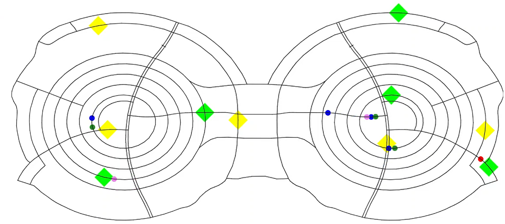
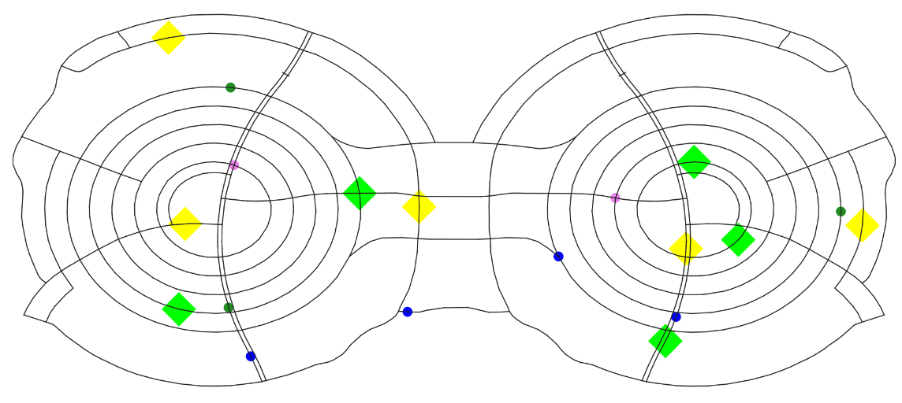

# Final implementation - Team 06

### Authors
- Albert Compte
- Rubén Cuervo
- Pranjal Jain
- Hajar Lachheb
- Saurabh Nagarkar
### Description

In this project, by using [Dedale](https://dedale.gitlab.io/) (a JADE-based agent environment framework), we have simulated a treasure hunt problem in which a Multi-Agent System must collect conjointly a total of ten treasures in an undirected graph.

Inside this folder, two different scenarios can be simulated:
- If a more complex model containing group formation mechanisms as well as superior functionalities wants to be tested, you must vary all the behaviours present inside each agent in the agents folder (in the `setup()` section) by its version without containing the V2 suffix. Moreover, to add the coordinator necessary for this simulation, AGENT Coordinator section present in `Principal.java` must be uncommented. In this implementation, the agents will try to solve the task (in a suboptimal way) by using the architecture, cooperation and communication decribed at point 4 of the `Final_documentation_Team06.pdf` file.



- If a simpler but most effective model wants to be tested, keep the code as it is. By doing so, three explorers, two tankers and four collectors will perform the treasure hunt task by using the architecture, cooperation and communication decribed at point 5 of the `Final_documentation_Team06.pdf` file. We recommend running this version as much better results can be achieved.



### Requirements and execution instructions

The requirements for the project are:

- Any version of JDK 18.
- Maven 3+ (already installed if you use IntelliJ IDE)

And to run the simulation, you will need to write the following Maven goals on Run Anything command line (accessed via `ctrl + ctrl` shortcut):
```
mvn install exec:java
```


